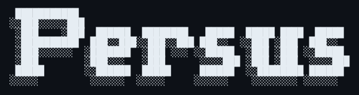
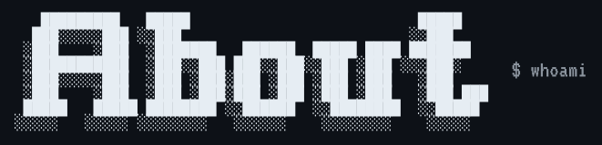
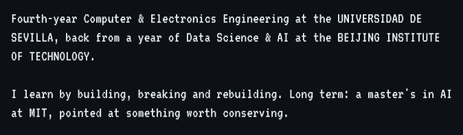
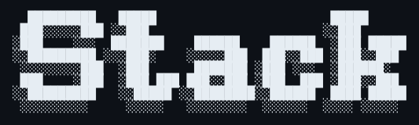
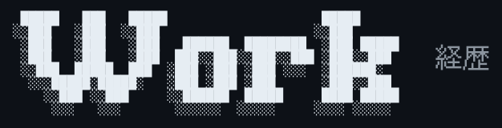
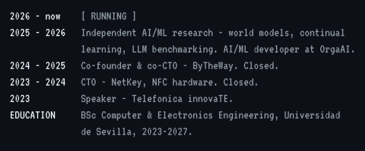
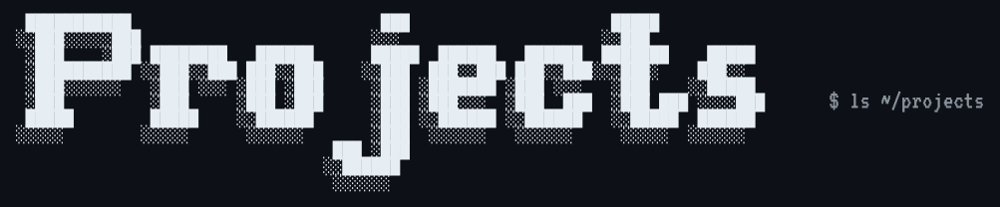
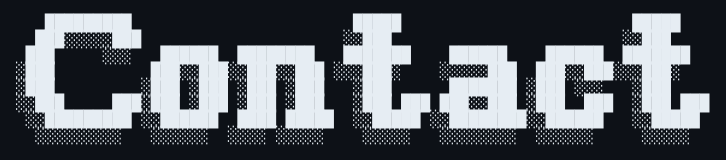

<picture><source media="(prefers-color-scheme: light)" srcset="assets/p-hands-l.png"></picture>

   

<picture><source media="(max-width: 600px)" srcset="assets/s-tagline-n.svg"></picture>

<picture><source media="(max-width: 600px)" srcset="assets/s-tags-n.svg"></picture>

   

<picture><source media="(max-width: 600px)" srcset="assets/s-about-n.svg"></picture>

   

<picture><source media="(max-width: 600px)" srcset="assets/s-stack-n.svg"></picture>

   

<picture><source media="(max-width: 600px)" srcset="assets/s-work-n.svg"></picture>

   

<a href="https://github.com/PersusUS/WorldModelsBenchmark"><picture><source media="(max-width: 600px)" srcset="assets/s-p-wmf-n.svg"></picture></a><a href="https://persus.netlify.app/projects/perseo"><picture><source media="(max-width: 600px)" srcset="assets/s-p-perseo-n.svg"></picture></a><a href="https://persus.netlify.app/projects/hybridmamba"><picture><source media="(max-width: 600px)" srcset="assets/s-p-hybridmamba-n.svg"></picture></a><a href="https://persus.netlify.app/projects/multilingual"><picture><source media="(max-width: 600px)" srcset="assets/s-p-multilingual-n.svg"></picture></a><a href="https://persus.netlify.app/projects/nightshift"><picture><source media="(max-width: 600px)" srcset="assets/s-p-nightshift-n.svg"></picture></a><a href="https://persus.netlify.app/projects/magi"><picture><source media="(max-width: 600px)" srcset="assets/s-p-magi-n.svg"></picture></a><a href="https://persus.netlify.app/projects/agentic-traces"><picture><source media="(max-width: 600px)" srcset="assets/s-p-traces-n.svg"></picture></a><a href="https://persus.netlify.app/projects/kotoba"><picture><source media="(max-width: 600px)" srcset="assets/s-p-kotoba-n.svg"></picture></a>

 

   

<picture><source media="(max-width: 600px)" srcset="assets/s-fetch-n.svg"></picture>

   

<picture><source media="(max-width: 600px)" srcset="assets/s-now-n.svg"></picture>

   

&nbsp;&nbsp;&nbsp;&nbsp;&nbsp;&nbsp;

  

<picture><source media="(max-width: 600px)" srcset="assets/s-coords-n.svg"></picture>

