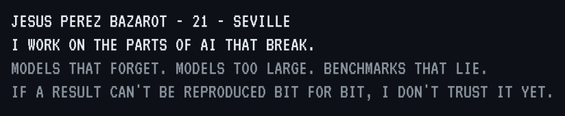
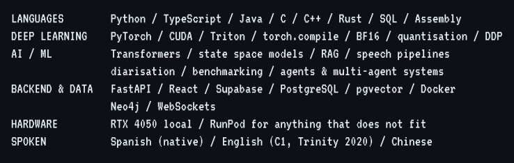
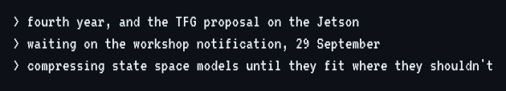

<div align="center">


</div>

```
 ███████████
░░███░░░░░███
 ░███    ░███  ██████  ████████   █████  █████ ████  █████
 ░██████████  ███░░███░░███░░███ ███░░  ░░███ ░███  ███░░
 ░███░░░░░░  ░███████  ░███ ░░░ ░░█████  ░███ ░███ ░░█████
 ░███        ░███░░░   ░███      ░░░░███ ░███ ░███  ░░░░███
 █████       ░░██████  █████     ██████  ░░████████ ██████
░░░░░         ░░░░░░  ░░░░░     ░░░░░░    ░░░░░░░░ ░░░░░░
```

<div align="center">




</div>

```
   █████████   █████                          █████
  ███░░░░░███ ░░███                          ░░███
 ░███    ░███  ░███████   ██████  █████ ████ ███████
 ░███████████  ░███░░███ ███░░███░░███ ░███ ░░░███░
 ░███░░░░░███  ░███ ░███░███ ░███ ░███ ░███   ░███
 ░███    ░███  ░███ ░███░███ ░███ ░███ ░███   ░███ ███
 █████   █████ ████████ ░░██████  ░░████████  ░░█████
░░░░░   ░░░░░ ░░░░░░░░   ░░░░░░    ░░░░░░░░    ░░░░░
```

<div align="center">


</div>

```
  █████████   █████                       █████
 ███░░░░░███ ░░███                       ░░███
░███    ░░░  ███████    ██████    ██████  ░███ █████
░░█████████ ░░░███░    ░░░░░███  ███░░███ ░███░░███
 ░░░░░░░░███  ░███      ███████ ░███ ░░░  ░██████░
 ███    ░███  ░███ ███ ███░░███ ░███  ███ ░███░░███
░░█████████   ░░█████ ░░████████░░██████  ████ █████
 ░░░░░░░░░     ░░░░░   ░░░░░░░░  ░░░░░░  ░░░░ ░░░░░
```

<div align="center">



</div>

```
 █████   ███   █████                    █████
░░███   ░███  ░░███                    ░░███
 ░███   ░███   ░███   ██████  ████████  ░███ █████
 ░███   ░███   ░███  ███░░███░░███░░███ ░███░░███
 ░░███  █████  ███  ░███ ░███ ░███ ░░░  ░██████░
  ░░░█████░█████░   ░███ ░███ ░███      ░███░░███
    ░░███ ░░███     ░░██████  █████     ████ █████
     ░░░   ░░░       ░░░░░░  ░░░░░     ░░░░ ░░░░░
```

<div align="center">


</div>

```
 ███████████                          ███                     █████
░░███░░░░░███                        ░░░                     ░░███
 ░███    ░███ ████████   ██████      █████  ██████   ██████  ███████    █████
 ░██████████ ░░███░░███ ███░░███    ░░███  ███░░███ ███░░███░░░███░    ███░░
 ░███░░░░░░   ░███ ░░░ ░███ ░███     ░███ ░███████ ░███ ░░░   ░███    ░░█████
 ░███         ░███     ░███ ░███     ░███ ░███░░░  ░███  ███  ░███ ███ ░░░░███
 █████        █████    ░░██████      ░███ ░░██████ ░░██████   ░░█████  ██████
░░░░░        ░░░░░      ░░░░░░       ░███  ░░░░░░   ░░░░░░     ░░░░░  ░░░░░░
                                 ███ ░███
                                ░░██████
                                 ░░░░░░
```

<div align="center">


</div>

<div align="center">

<a href="https://github.com/PersusUS/WorldModelsBenchmark"></a>
<a href="https://persus.netlify.app/projects/perseo"></a>
<a href="https://persus.netlify.app/projects/hybridmamba"></a>
<a href="https://persus.netlify.app/projects/jetson"></a>
<a href="https://persus.netlify.app/projects/multilingual"></a>
<a href="https://persus.netlify.app/portfolio"></a>

</div>

```
 ██████   █████
░░██████ ░░███
 ░███░███ ░███   ██████  █████ ███ █████
 ░███░░███░███  ███░░███░░███ ░███░░███
 ░███ ░░██████ ░███ ░███ ░███ ░███ ░███
 ░███  ░░█████ ░███ ░███ ░░███████████
 █████  ░░█████░░██████   ░░████░████
░░░░░    ░░░░░  ░░░░░░     ░░░░ ░░░░
```

<div align="center">



</div>

```
   █████████                       █████                        █████
  ███░░░░░███                     ░░███                        ░░███
 ███     ░░░   ██████  ████████   ███████    ██████    ██████  ███████
░███          ███░░███░░███░░███ ░░░███░    ░░░░░███  ███░░███░░░███░
░███         ░███ ░███ ░███ ░███   ░███      ███████ ░███ ░░░   ░███
░░███     ███░███ ░███ ░███ ░███   ░███ ███ ███░░███ ░███  ███  ░███ ███
 ░░█████████ ░░██████  ████ █████  ░░█████ ░░████████░░██████   ░░█████
  ░░░░░░░░░   ░░░░░░  ░░░░ ░░░░░    ░░░░░   ░░░░░░░░  ░░░░░░     ░░░░░
```

<div align="center">

<a href="https://persus.netlify.app"></a>
<a href="mailto:jp.bazarot@gmail.com"></a>
<a href="https://www.linkedin.com/in/jpbazarot/"></a>
<a href="https://www.x.com/JPBazarot"></a>
<a href="https://www.instagram.com/jpbazarot/"></a>




</div>
