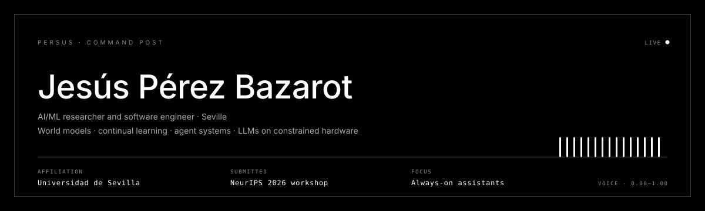
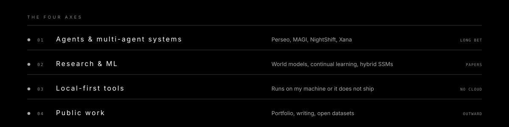

<div align="center">
  
</div>

<div align="center">

[](https://persus.netlify.app)
[](mailto:jp.bazarot@gmail.com)
[](https://linkedin.com/in/jpbazarot)
[](https://x.com/JPBazarot)
[](https://www.informatica.us.es/)

</div>

---

I build systems that stay on. Voice assistants that run all day, benchmarks that produce a
finding instead of a leaderboard, and tools that work with the network unplugged. Most of what
I ship answers the same question: **what survives contact with a real machine?**

Right now that means world models and catastrophic forgetting, small models on constrained
hardware, and agent architectures where the state machine — not the model — decides what
happens next.

---

### `STATUS`

| | |
|---|---|
| `SUBMITTED` | *Distance does not order forgetting* — CL4FMAgents @ **NeurIPS 2026**, notification 29 Sep |
| `BUILDING`  | **Perseo** — always-on voice + screen assistant: queue, memory, policy, eight agents |
| `READING`   | Continual learning for world models, state-space hybrids, on-device inference |
| `OPEN TO`   | Research collaborations, internships, anything where the hardware pushes back |

<div align="center">
  
</div>

---

### `SELECTED WORK`

| Project | What it is | The part worth reading |
|---|---|---|
| **[WorldModelsBenchmark](https://github.com/PersusUS/WorldModelsBenchmark)** | Catastrophic forgetting in world models — 3 families × 3 distances × 5 methods | The distance axis **does not** order forgetting (rank correlation +0.00), and the forgetting hides in the encoder: reconstruction degrades ×811 while the standard metric reports *improvement* |
| **Perseo** | Tauri v2 + React 19 + Gemini Live: voice, camera, screen, RAG over my own vault | Rust↔Python bridge went from 7.5 s to 0.30 s per call by making it persistent — over pipes, not localhost HTTP, because anything on `127.0.0.1` is reachable by any process |
| **[ReasoningTraces](https://github.com/PersusUS/ReasoningTraces)** | Annotated agentic reasoning traces | Hand-verified before anyone gets to cite it |
| **HybridMamba-11** | 11 interleaved Mamba + Transformer layers in a U-Net, 16 MB | Hillis–Steele parallel scan, validated on the hardware I actually had |
| **MAGI** | Tri-model consensus (MELCHIOR / BALTHASAR / CASPER) that votes | The decision is made by the procedure, not by a model |
| **Kotoba** | Japanese SRS: the entire JLPT, 20 785 cards, my own SM-2 | Standard library, SQLite and one page — nothing leaves the device, not even inside the APK |
| **MagicOCR** | MTG card scanner by 64-bit dHash | No image is ever uploaded: 128 bits cross the network |
| **Z13-Zodiac** | Can a 13-symbol cipher be solved at all? Bit budget and statistical control | Eight avenues refuted, each with its p-value — the negatives *are* the product |

Case studies for every project — including the ones that live in private repos — are at
**[persus.netlify.app](https://persus.netlify.app)**.

<div align="center">
  
</div>

---

### `STACK`

```text
LANGUAGES    Python · TypeScript · Rust · C · SQL
ML           PyTorch · Mamba/SSM · VAE + world models · EWC, replay, progressive nets
SYSTEMS      Tauri · React · FastAPI · SQLite · ChromaDB · WebSocket streaming
HARDWARE     Jetson Orin Nano · quantised local LLMs · RTX-class single-GPU training
PRACTICE     Tests before claims · numbers generated, never typed · negative results published
```

---

### `SIGNAL`

<div align="center">


</div>

---

<div align="center">
<sub><code>PERSUS · SEVILLE · ALWAYS ON</code></sub>
</div>
